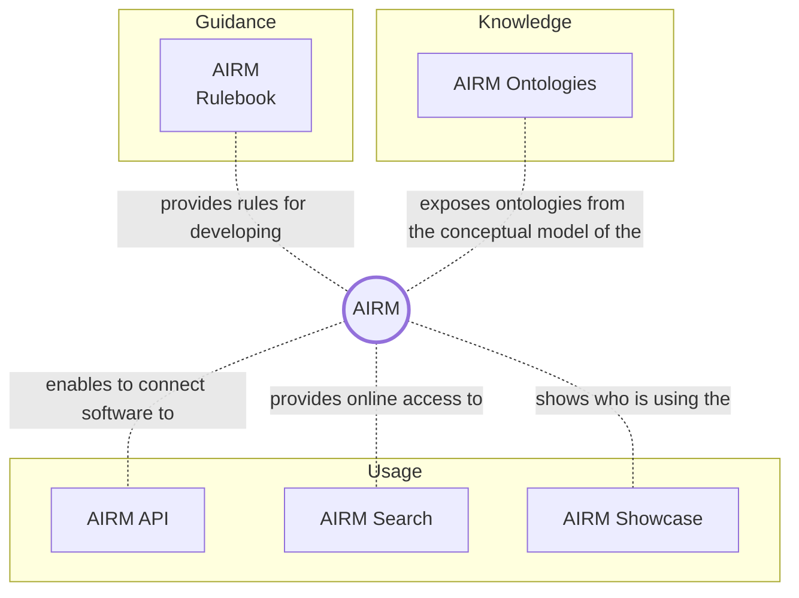
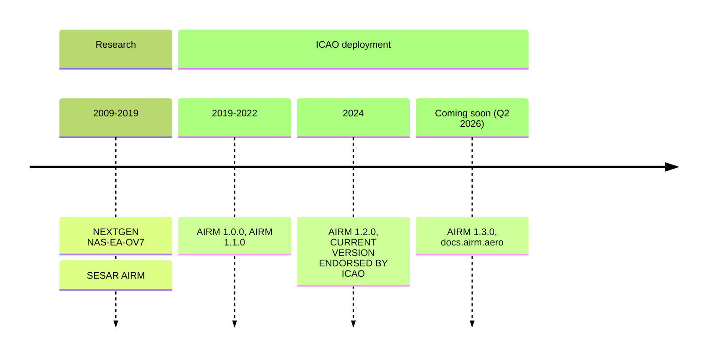

# Welcome to the AIRM User Manual

Welcome to the AIRM User Manual.

## Content overview

## What do you want to do?

| Your AIRM use case | Chapters relevant to you |
|:------------------ | :------------------------|
| Use the terms and information constructs of the AIRM to support operational concept development. | [`AIRM Search`](https://airm.aero/dictionary/1.2.0/search), [`AIRM Ontologies`](https://airm-ccb.github.io/airm-user-manual-1.3.0-testing/#/knowledge/overview) `...` |
| Use the AIRM when defining IERs / to express requirements | [`AIRM Search`](https://airm.aero/dictionary/1.2.0/search), [`AIRM Ontologies`](https://airm-ccb.github.io/airm-user-manual-1.3.0-testing/#/knowledge/overview) `...` |
| Use the AIRM by importing its content into a regional or local architecture repository or a regional or local reference model | `...` |
| Use the AIRM as a reference for cross-domain coordination activities | `...` |
| Use the AIRM as a reference to align a data catalogue, a data dictionary or a standard information service payload to the AIRM | `...` |
| Use the AIRM as a semantic reference when reading information inputs from various sources and writing outputs. | `...` |
| Provide a dedicated evidence of the alignment of the information service payload with the AIRM. | `...` |
| Derive service payload structure from the AIRM | `...` |

## AIRM Release history

## Terminology

| Term | Definition |
| :-   | :--------- |
| `AIRM models` | Shorthand to include the `AIRM Conceptual Model`, `AIRM Logical Model` and `AIRM Contextual Model`.|
| `Conceptual Model` | A conceptual model is a model of the information about the concepts in the universe of discourse, relevant to the architecture effort. | 
| `Logical Model` | The logical model is a specification of business/operational information requirements as a formal data structure, where relationships and classes (entities) are used to specify the logic which underpins the information. |
| `Mapping` | A set of traces that establishes a semantic correspondence between a concept in an information definition and AIRM concepts. |
| `Physical Data Model` | The physical data model specifies how the logical data model will be instantiated in a particular product or service. It takes into account implementation restrictions and performance issues whilst still enforcing the constraints, relationships and typing of the logical model. |
| `Trace` | A directed link from a concept in an information definition to an AIRM concept. |
| `Change proposal`  | Part of a change request describing a solution to the issue identified in the request. |
| `Change request`  | A request to modify a managed object.   |
| `Managed object`  | An artefact which can only be modified by using the AIRM change management procedures here defined. (For a list of `Managed objects`, see section 5). |
| `Requestor`  | Stakeholder submitting a change request. |

## Acronyms

| Term | Definition |
| :-   | :--------- |
| `ADS-B` | Automatic Dependant Surveillance - Broadcast |
| `ADS-C` | Automatic Dependant Surveillance - Contract |
| `AIRM` | ATM Information Reference Model |
| `ASCII` | American Standard Code for Information Interchange |
| `ATM` | Air Traffic Management |
| `BSD` | Berkeley Software Distribution |
| `EBNF` | Extended Backus–Naur Form |
| `EXOT` | Estimated Taxi-Out Time |
| `FANS` | Future Air Navigation System |
| `ICAO` | International Civil Aviation Organization |
| `IEC` | International Electrotechnical Commission |
| `IETF` | Internet Engineering Task Force |
| `ISO` | International Standards Organization |
| `NAF` | NATO Architecture Framework |
| `NATO` | North Atlantic Treaty Organisation |
| `NSS` | Namespace Specific String |
| `NSV` | NAF System View |
| `OMG` | Object Management Group |
| `STANAG` | Standardization Agreement (NATO) |

