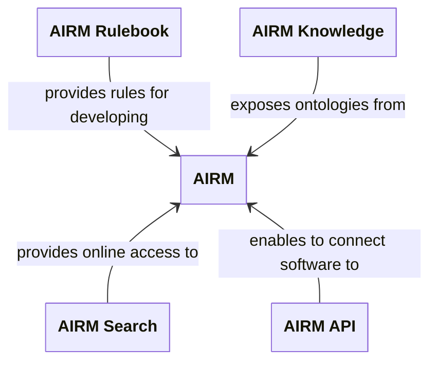

# Welcome to the AIRM User Manual

Welcome to the AIRM User Manual.

`TODO`

## What do you want to do?



```mermaid
timeline
    title History of AIRM
    section  R&D
      2009-2019 : NEXTGEN NAS-EA-OV7
                : SESAR AIRM
    section  ICAO deployment
      2019-2022 : AIRM 1.0.0, AIRM 1.1.0
      2024      : AIRM 1.2.0, CURRENT VERSION ENDORSED BY ICAO
      Coming soon (Q1 2025) : AIRM 1.3.0
```_
