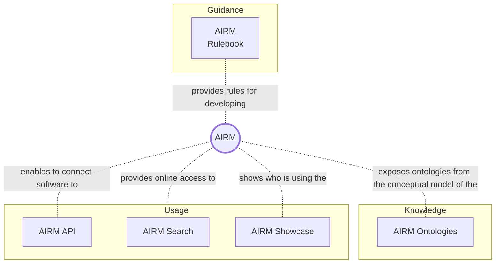
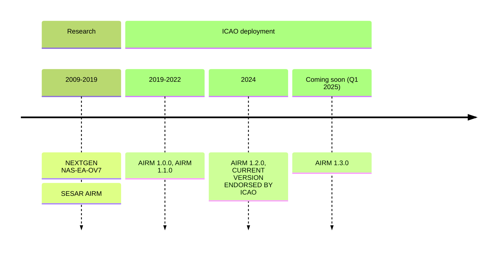

# Welcome to the AIRM User Manual

Welcome to the AIRM User Manual.

## Content overview

## What do you want to do?

| Your AIRM use case | Chapters relevant to you |
|:------------------ | :------------------------|
| Use the terms and information constructs of the AIRM to support operational concept development. | [`AIRM Search`](https://airm.aero/dictionary/1.2.0/search), [`AIRM Ontologies`](https://airm-ccb.github.io/airm-user-manual-1.3.0-testing/#/knowledge/overview) `...` |
| Use the AIRM when defining IERs / to express requirements | [`AIRM Search`](https://airm.aero/dictionary/1.2.0/search), [`AIRM Ontologies`](https://airm-ccb.github.io/airm-user-manual-1.3.0-testing/#/knowledge/overview) `...` |
| Use the AIRM by importing its content into a regional or local architecture repository or a regional or local reference model | `...` |
| Use the AIRM as a reference for cross-domain coordination activities | `...` |
| Use the AIRM as a reference to align a data catalogue, a data dictionary or a standard information service payload to the AIRM | `...` |
| Use the AIRM as a semantic reference when reading information inputs from various sources and writing outputs. | `...` |
| Provide a dedicated evidence of the alignment of the information service payload with the AIRM. | `...` |
| Derive service payload structure from the AIRM | `...` |

## AIRM Release history

