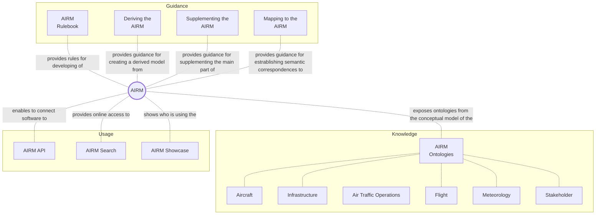
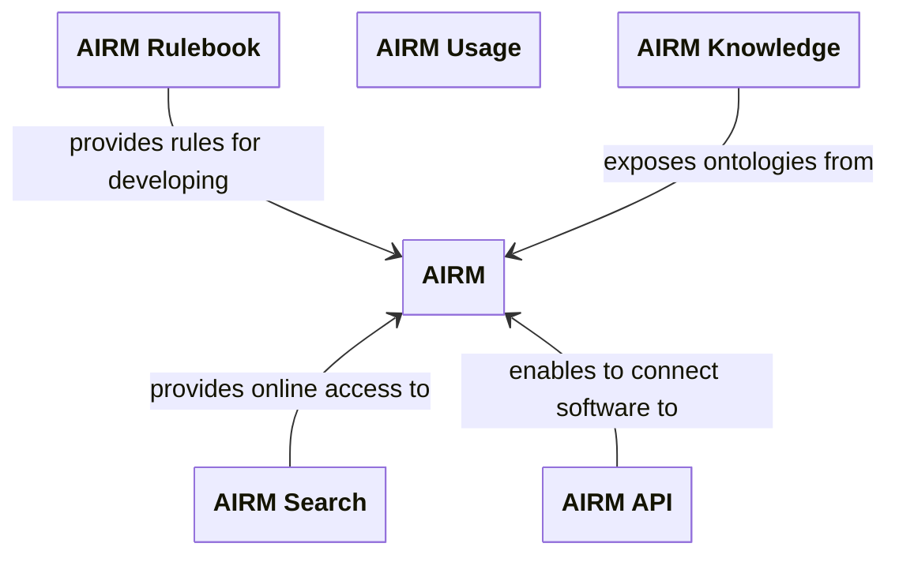
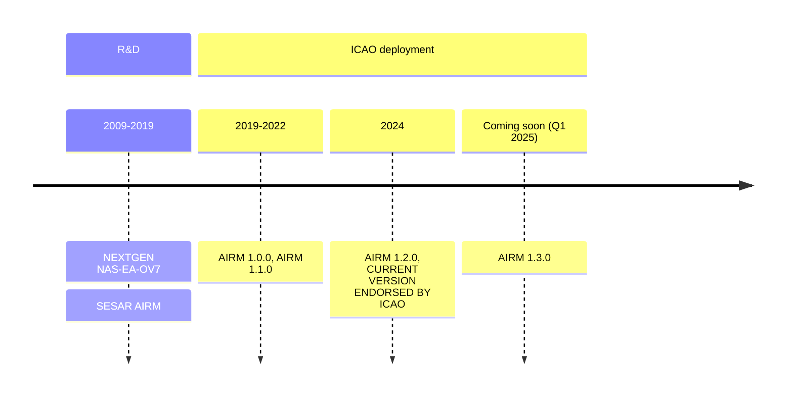

# Welcome to the AIRM User Manual

Welcome to the AIRM User Manual.

## Content overview

```mermaid
flowchart  TD

AIRM((AIRM))

subgraph Guidance
AIRM_RULEBOOK[AIRM<br>Rulebook]
DERIVE_AIRM[Deriving the<br>AIRM]
SUPPLEMENT_AIRM[Supplementing the<br>AIRM]
MAP_TO_AIRM[Mapping to the<br>AIRM]
end

AIRM_RULEBOOK-. provides rules for developing of .- AIRM
DERIVE_AIRM-. provides guidance for creating a derived model from .-AIRM
SUPPLEMENT_AIRM-. provides guidance for supplementing the main part of .-AIRM
MAP_TO_AIRM-. provides guidance for estrablishing semantic correspondences to .-AIRM

subgraph Knowledge
  direction LR
  AIRM_ONTOLOGIES[AIRM<br>Ontologies]
  ONTOLOGY_AIRCRAFT[Aircraft]
  ONTOLOGY_INFRASTRUCTURE[Infrastructure]
  ONTOLOGY_ATO[Air Traffic Operations]
  ONTOLOGY_FLIGHT[Flight]
  ONTOLOGY_METEO[Meteorology]
  ONTOLOGY_STAKEHOLDER[Stakeholder]
  AIRM_ONTOLOGIES-.-ONTOLOGY_AIRCRAFT
  AIRM_ONTOLOGIES-.-ONTOLOGY_INFRASTRUCTURE
  AIRM_ONTOLOGIES-.-ONTOLOGY_FLIGHT
  AIRM_ONTOLOGIES-.-ONTOLOGY_METEO
  AIRM_ONTOLOGIES-.-ONTOLOGY_STAKEHOLDER
end

AIRM-. exposes ontologies from the conceptual model of the .-AIRM_ONTOLOGIES

subgraph Usage
AIRM_API[AIRM API]
AIRM_SEARCH[AIRM Search]
AIRM_SHOWCASE[AIRM Showcase]
end

AIRM -. enables to connect software to .- AIRM_API
AIRM -. provides online access to .- AIRM_SEARCH
AIRM -. shows who is using the .- AIRM_SHOWCASE

style AIRM stroke-width:3px
```

## What do you want to do?

```mermaid
---
  config:
    class:
      hideEmptyMembersBox: true
---
classDiagram
   class AIRM
   class AIRM_Knowledge["AIRM Knowledge"]
   class AIRM_Usage["AIRM Usage"]
   class AIRM_Rulebook["AIRM Rulebook"]
   class AIRM_API["AIRM API"]
   class AIRM_Search["AIRM Search"]
   
   %% class AIRM_Contextual_Model["AIRM Contextual Model"]
   %% class AIRM_Conceptual_Model["AIRM Conceptual Model"]
   %% class AIRM_Logical_Model["AIRM Logical Model"]
   %% class AIRM_User_Manual["AIRM User Manual"]

   AIRM_Rulebook --> AIRM : provides rules for developing
   AIRM_Knowledge --> AIRM : exposes ontologies from
   AIRM <-- AIRM_Search : provides online access to
   AIRM <-- AIRM_API: enables to connect software to 

  click AIRM_Rulebook href "https://airm-ccb.github.io/airm-user-manual-1.3.0-testing/#/guidance/airm_rulebook" "Browse the AIRM Rulebook"
  click AIRM_Knowledge href "https://airm-ccb.github.io/airm-user-manual-1.3.0-testing/#/knowledge/aircraft" "Discover the AIRM ontologies"
  click AIRM_Search href "https://airm.aero/dictionary/1.2.0/search" "Search for ATM terms, abbreviations and concepts"
  click AIRM_API href "https://airm.aero/developers/api" "Connect your software"
```

## AIRM Release history

```mermaid
timeline
    section  R&D
      2009-2019 : NEXTGEN NAS-EA-OV7
                : SESAR AIRM
    section  ICAO deployment
      2019-2022 : AIRM 1.0.0, AIRM 1.1.0
      2024      : AIRM 1.2.0, CURRENT VERSION ENDORSED BY ICAO
      Coming soon (Q1 2025) : AIRM 1.3.0
```
