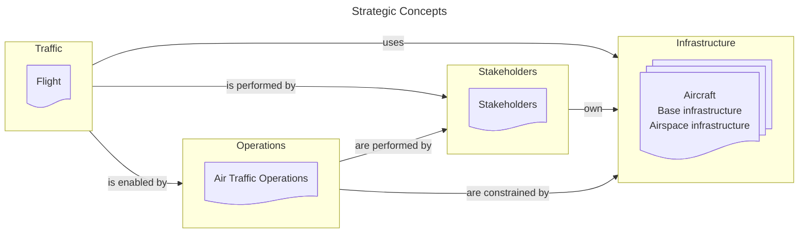

# AIRM Ontologies

## Traffic

| AIRM Subject | Ontology | Description |
| :- | :- | :-------------------------- |
| `Flight` | [Flight](knowledge/flight.md) | Information about a specific flight. |
| `Flight` | [Flight Event](knowledge/flight_event.md) | Information about actions, tasks or facts relevant to a specific flight which occur at an instant.|
| `Flight` | [Flight Identifier](knowledge/flight_identifier.md) | Information about identifiers of a flight. |
| `Flight` | [Flight Phase](knowledge/flight_phase.md) | Information about period-in-time occurrences during a Flight. |
| `Flight` | [Movement](knowledge/movement.md) | Information about movement of an aircraft both in the air and on the ground including position, time, and at least via calculation, speed and acceleration. |

## Operations

| AIRM Subject | Ontology | Description |
| :- | :- | :-------------------------- |
| `Air Traffic Operations` | [Aerodrome Operations](knowledge/aerodrome_operations.md) | Information about planning, execution and analysis of airport airside activities, including, but not limited to, how the aerodrome operators provide the needed ground infrastructure and precise surface guidance to improve safety and maximize aerodrome capacity in all weather conditions. |
| `Air Traffic Operations` | [Airspace User Operations](knowledge/airspace_user_operations.md) | Information about the ATM-related aspect of flight operations. |
| `Air Traffic Operations` | [ATM Phases](knowledge/atm_phases.md) | Information about groupings of related collaborative ATM activities relative to a flight or a group of flights. |
| `Air Traffic Operations` | [ATM Service Delivery Management](knowledge/atm_service_delivery_management.md) | Information about the balance and consolidation of the decisions of the various other processes/services, as well as the time horizon at which, and the conditions under which, these decisions are made. |
| `Air Traffic Operations` | [Cargo Operations](knowledge/cargo_operations.md) | Information on all activities required to enable the safe transport of cargo by air. |
| `Air Traffic Operations` | [Conflict Management](knowledge/conflict_management.md) | Information about a) the strategic conflict management through airspace organization and management, the demand and capacity balancing, and traffic synchronization; b) separation provision; c) and collision avoidance. |
| `Air Traffic Operations` | [Demand and Capacity Balancing](knowledge/demand_and_capacity_balancing.md) | Information about the strategic evaluation of the system-wide traffic flows and aerodrome capacities to allow airspace users to determine when, where and how they operate, while mitigating conflicting needs for airspace and aerodrome capacity. |
| `Air Traffic Operations` | [Emergency Operations](knowledge/emergency_operations.md) | Information about the activities carried out in case of an emergency. |
| `Air Traffic Operations` | [Information Services Products](knowledge/information_services_products.md) | Information about the products exchanged by information services. |
| `Air Traffic Operations` | [Aeronautical Information Product](knowledge/aeronautical_information_product.md) |  |
| `Air Traffic Operations` | [Flight Information Product](knowledge/flight_information_product.md) |  |
| `Air Traffic Operations` | [Meteorological Information Product](knowledge/meteorological_information_product.md) |  |
| `Air Traffic Operations` | [Coordination](knowledge/coordination.md) |  |

## Stakeholders

| AIRM Subject | Ontology | Description |
| :- | :- | :-------------------------- |
| `Stakeholders` | [Organisation, Role and Service](knowledge/organisation_role_and_service.md) | Generic framework for modeling organizations, roles and services. This is to be used for typing. Based on the W3C Organization proposal. |
| `Stakeholders` | [Agent](knowledge/agent.md) | Specific common instances of "Agent" and their specialization relations. |
| `Stakeholders` | [Business Services](knowledge/business_services.md) | Specific common instances of "Service" and their specialization relations. |
| `Stakeholders` | [Document and Agreement](knowledge/document_and_agreement.md) | Description of cross-organizational agreements and documents. |
| `Stakeholders` | [Organisation](knowledge/organisation.md) | Specific common instances of "Organisation" and their specialization relations. |
| `Stakeholders` | [Role](knowledge/role.md) | Specific common instances of "Role" and their specialization relations |

## Infrastructure

| AIRM Subject | Ontology | Description |
| :- | :- | :-------------------------- |
| `Aircraft` | [Aircraft](knowledge/aircraft.md) | Information about the aircraft. |
| `Airspace Infrastructure` | [Airspace](knowledge/airspace.md) | Information about the defined three-dimensional portions of the atmosphere relevant to ATS. |
| `Airspace Infrastructure` | [Infrastructure Point](knowledge/infrastructure_point.md) | Information about points in an airspace.  |
| `Airspace Infrastructure` | [Route and Procedure](knowledge/route_and_procedure.md) | Information about the routes and procedures designed for channelling the flow of traffic en-route and while departing and landing. |
| `Base Infrastructure` | [Aerodrome Infrastructure](knowledge/aerodrome_infrastructure.md) | Informaion about the  aerodrome including any installations and equipment. |
| `Base Infrastructure` | [Communication Infrastructure](knowledge/communication_infrastructure.md) | Information about the communication infrastructure. |
| `Base Infrastructure` | [Navigation Infrastructure](knowledge/navigation_infrastructure.md) | Information about the navigation infrastructure.  |
| `Base Infrastructure` | [Surveillance Infrastructure](knowledge/surveillance_infrastructure.md) | Information about the surveillance infrastructure. |
| `Base Infrastructure` | [Obstacle](knowledge/obstacle.md) | Information about ground based objects that are detrimental to the safe execution of flights. |
| `Base Infrastructure` | [Satellite System](knowledge/satellite_system.md) | Information about satellite systems. |

## Other

| AIRM Subject | Ontology | Description |
| :- | :- | :-------------------------- |
| `Common` | [Geometry](knowledge/geometry.md) | Information about ATM-related geometry concepts. |
| `Common` | [Geospatial](knowledge/geospatial.md) | Information related to land, ice and ocean surfaces and any object with vertical extent above and/or under ground. |
| `Common` | [Temporal](knowledge/temporal.md) | Information about ATM-related temporal concepts. |
| `Meteorology` | [Meteorology](knowledge/meteorology.md) | Information about meteorological observation, forecast, phenomena and any other statement relating to existing or expected meteorological conditions. |

